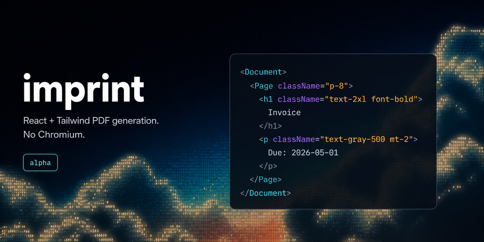

<div align="center">
  <a href="https://github.com/tamimbinhakim/imprint-pdf">
    
  </a>

<br />
<br />

[](LICENSE)
[](tsconfig.base.json)
[](https://biomejs.dev/)
[](https://pnpm.io/)
[](https://www.conventionalcommits.org)
[](#status)

Author PDFs as React components, styled with **real Tailwind classes**. Run them
anywhere JavaScript runs — Node, Bun, the browser, Vercel Edge, Cloudflare
Workers. No Chromium. Ever.

</div>

<!-- prettier-ignore -->
> [!WARNING]
> imprint-pdf is in **1.0.0-alpha**. The public API will move. Pin exact
> versions if anything depends on it. The name "imprint-pdf" is itself a
> placeholder until 1.0 — see [`docs/naming.md`](docs/naming.md).

```tsx
import { renderToBuffer, Document, Page } from '@imprint-pdf/react';

const pdf = await renderToBuffer(
  <Document>
    <Page size="A4" className="p-12 font-sans bg-white">
      <h1 className="text-3xl font-bold tracking-tight">Hello, PDF</h1>
      <p className="mt-4 text-base leading-relaxed text-pretty">
        Real Tailwind. Real React. Real typography. No browser.
      </p>
    </Page>
  </Document>,
);
```

```bash
npx imprint render Invoice.tsx --out=invoice.pdf
```

## Why imprint-pdf

The PDF problem in JavaScript has three bad answers:

1. **Spin up Chromium** (Puppeteer, Playwright, Gotenberg, DocRaptor, PDFShift)
   — 200 MB binaries, 1.5–3 s per render, no edge runtime.
2. **`@react-pdf/renderer`** — React ergonomics, but a hand-rolled `StyleSheet`
   DSL. Not real CSS. Not real Tailwind. No Knuth–Plass. No PDF/X.
3. **`pdf-lib` / `PDFKit` / `jsPDF`** — imperative coordinate-pushing. No layout
   engine. No React. No Tailwind.

imprint-pdf is the fourth option. A TypeScript library with a Rust + WASM core
that uses the **actual Tailwind v4 Oxide compiler**, the **actual HarfBuzz
shaping engine**, the **actual Knuth–Plass justification algorithm**, and the
**actual Taffy layout engine** (Block + Flexbox + CSS Grid). Sub-100 ms cold
starts on Cloudflare Workers. PDF/X-4 + PDF/UA-1 for the enterprise tier.

## Quick features

- **Real Tailwind classes.** `p-4 grid grid-cols-12 gap-6 text-pretty` — the
  real compiler, not a translator, not a subset. Plugins, presets, arbitrary
  values, OKLCH colors, `@theme` design tokens all work.
- **Real React.** A custom reconciler. JSX components, refs, hooks, Suspense.
  HTML elements (`<div>`, `<h1>`, `<table>`) compile to semantically tagged PDF
  nodes.
- **Real typography.** HarfBuzz shaping (Arabic, Indic, Thai, CJK, kerning,
  ligatures, variable fonts), Knuth–Plass justification, Plass page breaking
  (widows / orphans / footnotes).
- **Edge-native.** Sub-100 ms cold on Cloudflare Workers and Vercel Edge. Same
  code path on Node, Bun, the browser, Lambda, and Deno.
- **CSS Grid.** Taffy (Rust → WASM). Block + Flexbox + Grid in the same layout
  pass.
- **Vector charts.** Recharts, Visx, ECharts, Observable Plot SVG output flows
  through the vector pipeline — crisp at any zoom, no rasterized PNG.
- **AcroForms in JSX.** `<TextField>`, `<Checkbox>`, `<RadioGroup>`,
  `<Signature>` declared as components. Widget rectangles come from the same
  layout pass that lays out visual text.
- **Print-grade output (Enterprise).** PDF/X-4 + CMYK + ICC profiles + PDF/UA-1
  tagged PDF + PKCS#7 signing + factur-X / ZUGFeRD.

## Documentation

Full documentation lives in [`docs/`](docs/):

- **[Overview](docs/overview.md)** — what imprint-pdf does and where it fits
- **[Quick start](docs/quick-start.md)** — render your first PDF in five minutes
- **[Philosophy](docs/philosophy.md)** — why no Chromium, why real Tailwind, why
  Knuth–Plass
- **[Concepts](docs/concepts.md)** — documents, pages, the layout pass, the
  writer
- **[Guides](docs/README.md#guides)** — components, Tailwind, fonts, charts,
  forms, accessibility
- **[Frameworks](docs/README.md#frameworks)** — Next.js, Vite, Bun, Cloudflare
  Workers
- **[Cookbook](docs/README.md#cookbook)** — invoices, contracts, tickets,
  packing slips, books
- **[Reference](docs/README.md#reference)** — every component, every CLI flag,
  every export

## Installation

```bash
pnpm add @imprint-pdf/react @imprint-pdf/core
pnpm add -D @imprint-pdf/cli @imprint-pdf/tailwind
npx imprint init
```

## Quick start

Configure `imprint.config.ts`:

```ts
import { defineConfig } from '@imprint-pdf/core/config';

export default defineConfig({
  fonts: ['Inter', 'JetBrains Mono'],
  pageSize: 'A4',
  tailwind: { mode: 'compile-time' },
});
```

Author your PDF as a React component:

```tsx
import { Document, Page } from '@imprint-pdf/react';

export function Invoice({ data }: { data: InvoiceData }) {
  return (
    <Document title={`Invoice ${data.id}`}>
      <Page size="A4" className="p-12 font-sans bg-white">
        <h1 className="text-3xl font-bold tracking-tight">{data.id}</h1>
        <table className="mt-8 w-full text-sm">{/* … */}</table>
      </Page>
    </Document>
  );
}
```

Render anywhere:

```ts
import { renderToBuffer } from '@imprint-pdf/react';
const pdf = await renderToBuffer(<Invoice data={data} />);
```

```ts
// Cloudflare Worker
import { renderToStream } from '@imprint-pdf/react/standalone';
import wasm from '@imprint-pdf/react/imprint.wasm';

export default {
  async fetch(req: Request) {
    const stream = await renderToStream(<Invoice data={…} />, { wasm });
    return new Response(stream, {
      headers: { 'content-type': 'application/pdf' },
    });
  },
};
```

The full walkthrough is in [Quick start](docs/quick-start.md).

## How it works

```
Source code  →  React reconciler  →  PdfNode IR
                                          │
                                          ▼
                                Tailwind resolver
                            (Oxide CLI or WASM fallback)
                                          │
                                          ▼
                          Layout pass  (Taffy WASM)
                          + inline layout (Parley-lite)
                          + Knuth–Plass paragraph breaker
                          + Plass page breaker
                                          │
                                          ▼
                          Text & vector pipeline
                          (HarfBuzz, ICU4X, fontkit, resvg)
                                          │
                                          ▼
                          PDF writer  (pdf-lib v0 → imprint-pdf v1)
                                          │
                                          ▼
                          Uint8Array | ReadableStream
```

For the full design, see [`ARCHITECTURE.md`](ARCHITECTURE.md).

## Why imprint-pdf over the alternatives

| Capability                        | `@react-pdf` | Satori | pdfme | Forme | Chromium SaaS | Typst |   imprint-pdf    |
| --------------------------------- | :----------: | :----: | :---: | :---: | :-----------: | :---: | :--------------: |
| Real Tailwind classes             |   — (DSL)    | subset |   —   |   ✓   |       ✓       |   —   |      **✓**       |
| React / JSX components            |      ✓       |   ✓    | part. |   ✓   |       —       |   —   |      **✓**       |
| Edge runtimes (CF Workers)        |    part.     |   ✓    | part. |   ✓   |       —       |   ✓   |      **✓**       |
| CSS Grid                          |      —       |   —    |   —   |   ?   |       ✓       |   ✓   |  **✓** (Taffy)   |
| HarfBuzz-grade shaping            |      —       |   —    |   —   |   ✓   |       ✓       |   ✓   |      **✓**       |
| Knuth–Plass justification         |      —       |   —    |   —   |   —   |   Prince ≈    |   ✓   |      **✓**       |
| Variable fonts                    |    part.     |   —    |   —   |   ?   |       ✓       |   ✓   |      **✓**       |
| Arabic / Indic / Thai / CJK       |     weak     |  weak  | weak  | part. |       ✓       |   ✓   |      **✓**       |
| Vector charts                     |      —       |   —    |   —   |   ?   |       ✓       |   ✓   |      **✓**       |
| AcroForms in JSX                  |      —       |  n/a   | tmpl. |   ✓   |       —       |   —   |      **✓**       |
| PDF/X-4 + CMYK                    |      —       |   —    |   —   | part. |   DocRaptor   | part. | **✓ Enterprise** |
| PDF/UA-1 tagged PDF               |      —       |   —    |   —   |   ✓   |   DocRaptor   | part. | **✓ Enterprise** |
| Sub-100 ms edge cold start        |     n/a      |   ✓    | part. |   ✓   |       —       |   ✓   |      **✓**       |
| Same code: client + edge + server |    part.     |   ✓    |   ✓   |   ✓   |      n/a      |   ✓   |      **✓**       |

The one-liner: **Real Tailwind. Real React. Real typography. PDF anywhere — no
Chromium, ever.**

## Benchmarks

Measured with [`@imprint-pdf/bench`](packages/bench) on an Apple M-series laptop
(Node 20, 30 runs, 5 warmup), rendering the same 1-page invoice through every
JSX-driven library.

| Library                             |       mean | p95     | p99     |  Output |
| ----------------------------------- | ---------: | ------- | ------- | ------: |
| **`@imprint-pdf/react`**            | **4.3 ms** | 5.2 ms  | 5.8 ms  |  6.2 KB |
| `@react-pdf/renderer`               |    13.7 ms | 15.6 ms | 16.8 ms |  3.3 KB |
| Puppeteer (warm, browser reused)    |    50.6 ms | 51.1 ms | 51.1 ms | 46.9 KB |
| Puppeteer (cold, launch per render) |     473 ms | 494 ms  | 494 ms  | 46.9 KB |

- **3.15× faster than `@react-pdf/renderer`** on the only fair head-to-head
  comparison (both consume JSX, both run a layout pass).
- **~12× faster than warm Chromium**, **~110× faster than cold Chromium** — the
  cold number is what serverless functions actually pay, plus the 200 MB binary
  download.

Reproduce locally:

```bash
pnpm bench                    # runs competitors + complexity + pipeline + features
pnpm bench:chromium           # opt-in, downloads Chromium on first run
pnpm bench:all                # everything, including chromium
```

Imperative libraries (`pdfkit`, `pdf-lib`, `jsPDF`) and template-based ones
(`pdfme`) are intentionally excluded from the head-to-head — they're a different
paradigm (no layout engine, no React) and the comparison would flatter
imprint-pdf on ergonomics while making it look slow on µs-per-glyph.

## Examples

- [`examples/next-app`](examples/next-app) — Next.js App Router + RSC + edge
  route
- [`examples/vite-react`](examples/vite-react) — Vite + React SPA download
- [`examples/cloudflare-worker`](examples/cloudflare-worker) — Worker that
  streams a PDF in <100 ms cold
- [`examples/bun-server`](examples/bun-server) — Bun + Hono PDF endpoint

```bash
pnpm --filter @imprint-pdf/example-next-app dev
pnpm --filter @imprint-pdf/example-vite-react dev
pnpm --filter @imprint-pdf/example-cloudflare-worker dev
pnpm --filter @imprint-pdf/example-bun-server dev
```

## Status

**1.0.0-alpha.** Nothing is stable yet. The architecture is settled
([`ARCHITECTURE.md`](ARCHITECTURE.md)); the API isn't.

| Phase    | Versions        | What it means                                  |
| -------- | --------------- | ---------------------------------------------- |
| Alpha    | `1.0.0-alpha.x` | Anything can change in any release.            |
| Beta     | `1.0.0-beta.x`  | Public API frozen modulo bugs. Soak before GA. |
| 1.0      | `1.0.0`         | First stable release. Semver from here on.     |
| Post-1.0 | `1.x.y+`        | Backwards-compatible features and fixes.       |

See [`STABILITY.md`](STABILITY.md) for the full contract.

## Licensing

Every package is **Apache-2.0** — the engine, the React layer, the Tailwind
compiler, the CLI/integrations, _and_ the enterprise surface (PDF/X-4 with
CMYK + ICC, PDF/UA-1 tagged PDF, PKCS#7 signing, factur-X / ZUGFeRD). No
commercial seats, no time-bombed source. See [`LICENSING.md`](LICENSING.md).

## Contributing

```bash
pnpm install
pnpm dev         # turbo run dev across all packages
pnpm test        # vitest across the monorepo
pnpm typecheck   # composite tsc
pnpm lint        # biome check
```

See [`CONTRIBUTING.md`](CONTRIBUTING.md) for the full workflow and
[`.github/RELEASING.md`](.github/RELEASING.md) for the release process.

## License

**Apache-2.0** © [Tamim Bin Hakim](https://github.com/tamimbinhakim) and
contributors — applies to every package in the repository.
